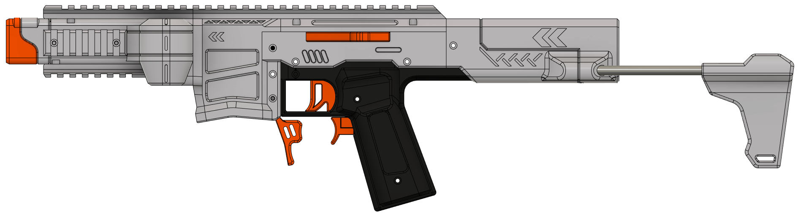

# Gryphon SLX
The "Gryphon SLX" Is A NEW SEPARATE BRANCH Of The "Gryphon" By Flygonial. 

Important Features:

* Uses 130 Sized, Hobby Grade Motors.
* Uses Heatset Inserts & M3 Screws.
* Uses Mechanical Rack & Pinion Pusher (1:3 Gear Ratio, 12mm Trigger Travel).
* Uses Hot-Swappable Flywheel Cages.
* Uses Ambidextrous Extended Mag Release.
* Uses Battery Stock.
* Features Sligtly Angled Magwell Utilizing FlexRelease™ (Accepts Worker Straight AND Angled Talon Magazines).
* Features Tactile Pusher (AESTHETIC ONLY Pusher Bolt).

Some Options/Variable Features:

* Options for "Standard" or "Wide" Grip Panels.

Required Hardware For Assembly Can Be Found At The QR Code/Link Below:

**If you have comments, feedback, or critique, please contact me on Discord. I can be found at 404#9081.**

**The commercial sale of this design is not permitted without proper permission. If you would like me to build one of these for you, or you would like to become a seller of this design, please reach out to me at the contact above.**

 This work is licensed under a <a rel="license" href="http://creativecommons.org/licenses/by-nc-sa/4.0/">Creative Commons Attribution Non-Commercial Share Alike 4.0 International License</a>.
